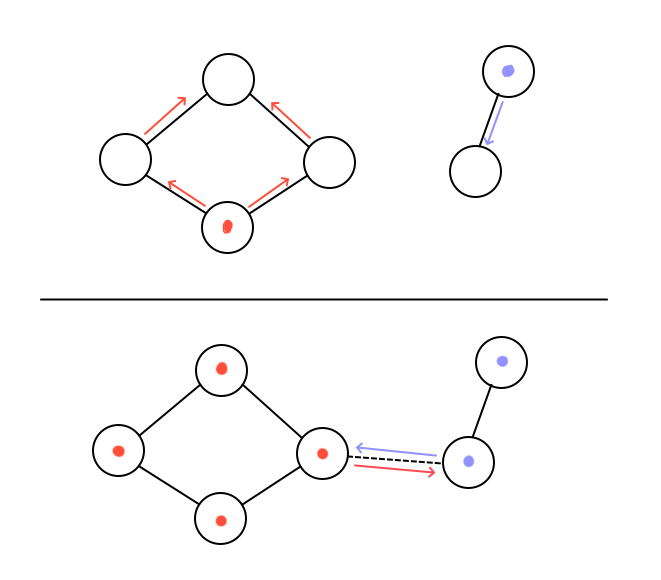
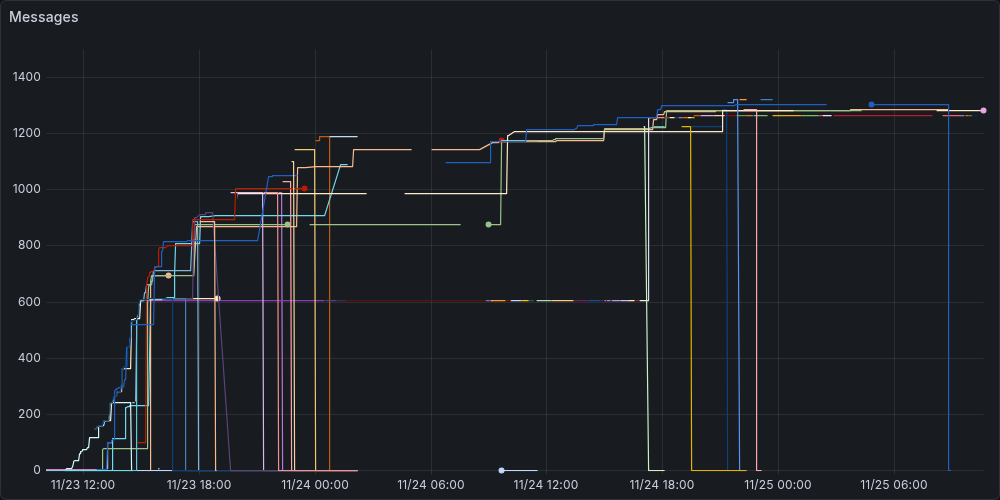
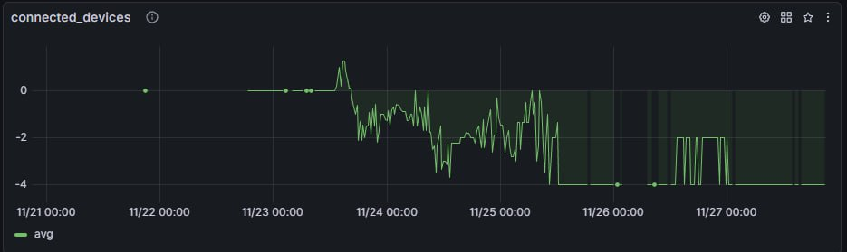

import LinkPreview from '../../components/LinkPreview.astro';

If you aren't aware, it is totally possible for phones to communicate without the need for the internet. Even if you travel far into the forest or deep underground, where the only thing you can play is the t-rex game, you can still message your friends. Provided they are nearby. Your phones can send signals to each other through the air, after all.

Usually this is not practical, but in certain situations - like in cruise ships - this could work quite well. The main problem with the idea is that the signal is quite faint. Wifi frequenzy is around 5GHz, while Bluetooth uses a frequency only around 2.5GHz. This means that Bluetooth signals propagate better than wifi, but wifi can travel farther. As an exapmle, A bluetooth signal in practice travels around 20 meters, little bit depending on how much obstructions are in the way. We can, however, forward that signal: once someone has a message, they can distribute it to other people. This way the original sender doesn't even need to connect to the receiver, as long as there is a path between them. This is the basis for a messaging app we tried to use in practice. I'll go more into the details of the inner workings in the technical section. 

These kind of messaging apps of course require quite many users to be effective, but we had a unique opportunity to test this in the wild. At the end of the fall we had [Otacruise](https://www.otacruise.com/). It is a trip to Stockholm with a boat full of Aalto-students. The whole boat is booked for us, so practically no outsides can get in. In the previous years we've had problems with the internet, so a working messaging app would be very appreciated. Thousands of Aalto-students without internet is the perfect place to test this kind of system in action. Me and couple others gathered a team and together we built a prototype of the idea, and tested it with a reasonably-sized group during the cruise. The idea would be that we would distribute the app just among our university, and when the time comes we'd see if the idea works in practice.

### Technical details

We aren't the first to come up with this idea, but most people cannot test it in a large-scale environment like we can. Some previous students have also came up with this idea during the cruise, but they have resorted to using some existing apps with a small group. We tested a couple and they were sub-par, requiring login or straight-up not working. We built our own version for three reasons.
1. We could say it was built for Otacruise, and we could add the possibility to send custom stickers often used in Aalto. This would hopefully get more people to use it.
2. We don't need sign up. The easier it is to use the better.
3. We can gather telemetry data and actually see how well works.

Let's now go through the message transfer idea idea more clearly. We'll represent people as nodes and connections between them as edges. When a node sends a message, it will be distributed to their neighbors. The neighbors will then propagate this forward. We cannot of course propagate the messages to nodes that nobody is connected to, but we'll make sure it is stored on everybody in our connected component.

When a new connection is formed, we always broadcast all (relevant) new messages between the two nodes. This way these two nodes now agree on the messages they have received. These nodes will again broadcast all new messages forward. We can also support direct messages and smaller group chats with this approach. We'll still transfer these direct messages between everybody, but we'll allow only the right participants to read them. 

In an ideal world, new connections would form and end at random. This would allow the messages to eventually reach every participant. Our hypothesis was that this is mostly true, as we could represent the drunk students as nodes doing a random walk. Our hypothesis was also that the center of the ship would work as a distribution point, as our Silja Line [ship](https://www.tallink.com/fi/laivalla/laivat/silja-symphony) has an open center - a promenade. The messages can travel around there unobstructed. If both of these were true, we could get messages distributed through the ship reasonably well.

There are a couple noteworthy challenges when building an app like this. We can use either Wifi, Bluetooth or BLE when transferring data, each with their strengths and weaknesses. In the implementation we used Google's [Nearby Connections](https://developers.google.com/nearby/connections), which abstracts this away from us and uses the best one available. This, however works only for android. Android and Apple don't really like to communicate to each other, with the only real solution being Bluetooth. Thus we didn't implement Apple support for this project.

### Results

During the cruise, the app was downloaded on 350 unique devices, which was a pleasant surprise. With this amount of people we could do a comprehensive test of the system. Unfortunately we were gathering data from only a subset of them, but it is nonetheless a representative sample. During the experiment there were approximately 1400 messages sent, most of which were distributed to most people. We intentionally didn't send all messages everywhere, for example to prevent excessive spamming. I'll be showing the most interesting graphs from the test.

_Message count on the tracked devices over time_

_Average amount of connected devices over time. Something has gone a bit wrong as it shouldn't go negative_

Looking at these graphs we can make couple conclusions. First, this kind of system theoretically does work. We can see the second graph oscillating, which means new connections are being constantly made and old ones (unfortunately) destroyed. Still the experience wasn't like the "instant" messaging we'd envisioned. Messages could take from 5 minutes to an hour to arrive, which hinders the experience quite a bit. Also the internet coverage was better as phones had internet at least 70% of the time. For these reasons the service had little use apart from testing it's functionality. It definitely still worked, just a bit slow. It could be that Nearby Connections wasn't using Wifi-frequency as much as we've hoped, instead relying on Bluetooth. This was indicated in our testing.

One of the major reasons why the app wasn't used, at least why I didn't use it that much, was also the same reason why we thought it would work: drunk students wondering around can be modeled as a random walk. They don't have a destination and therefore don't really care what is happening on their phone. While the app has notifications and other features you'd expect from a messaging app, people don't really care. They wonder around in their groups and see where they end up, instead of being on their phone all the time. And that, perhaps, is a good thing.

<LinkPreview
  href="https://play.google.com/store/apps/details?id=com.raskitech.cruisechat"
  title="Cruise Chat"
  description="CruiseChat aims to be a simple messaging app that works with peer-to-peer connections and therefore doesn't require internet."
  imgSrc="https://play-lh.googleusercontent.com/l6QTZRDR4K6oCHcHUhAePQqE5KKcyiGCQaiMlWyxGaaNdh9JiWbaQQPPGtUtO6YixItoxjCbPahV5VDRSSAa"
/>