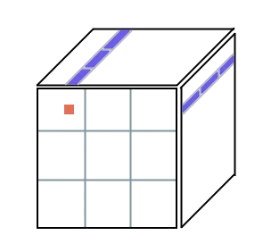
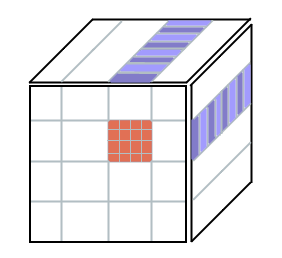
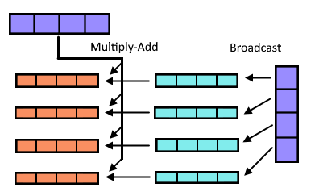
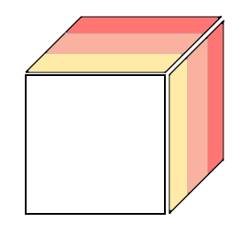

Recently I took a course in parallel computing, where the focus was on using all the available resources we have on our computers. The course was tough but really interesting, so I thought it would be interesting to share some of the concepts learned there. The course, called Programming Parallel Computers, can be found [online](https://ppc.cs.aalto.fi/) and there is an open version of it as well.

It’s helpful to have an example problem to go along with, so in this post I’ll be discussing matrix multiplication on the cpu. Assuming our matrices are squares of sidelength n, we need to do n<sup>3</sup> operations on them. Notably, there are many operations which we can do simultaneously, which makes this a very good example problem. Perhaps that’s why there are plenty of articles on matrix multiplication already. However, few of these go as deep as I’d like, so in this post I’ll try to continue where others have stopped. I can't cover everything, so if you haven't already, please read through _Siboehm_'s rather famous post on the topic [here](https://siboehm.com/articles/22/Fast-MMM-on-CPU). I will assume that as prerequisite knowledge.

### Baseline
```c++
for (int y = 0; y < ny; y++)
{
    for (int x = y; x < ny; x++)
    {
        float sum = 0;
        for (int k = 0; k < nx; k++)
            sum += mat[k + nx*y] * mat2[x + nx*k]
        result[x + y*ny] = sum;
    }
}
```


Here is the implementation implementation we'll start with. It goes through every result cell (x, y) one by one, and calculates the value. I’ll start measuring benchmarks when they don’t start to take half an hour on my testcases, but this runs quite poorly. Siboehm's blog post didn't use any preprocessing, but to get any reasonable results we are going to need it. One preprocessing step we can most certainly do to speed this up considerably is transpose the matrix 2 in advance. The transposition takes a bit of time, but it is in the order of O(n<sup>2</sup>) whereas our matrix multiplication is in O(n<sup>3</sup>). This means that any time it takes is going to be negligible compared to the multiplication. The preprocessing saves us from reordering the loops, which will come handy later. By taking the transform, we can get a continuous access pattern on both matrices in the multiplication. This gives us about 2x speedup in my experience. The speedup comes because we are accessing data in a more predictable (continous) way. Look at the inner-most loop in the example code:

```c++
// Transpose
for (int row = 0; row < nx; row++) 
	for (int col = 0; col < ny; col++)
		mat2_T[row + nx*col] = mat2[col + ny*row];

for (int y = 0; y < ny; y++)
{
    for (int x = y; x < ny; x++)
    {
        float sum = 0;
        for (int k = 0; k < nx; k++)
            sum += mat[k + nx*y] * mat2_T[k + nx*x];
        result[x + y*ny] = sum;
    }
}
```
  
### Optimizing

Let’s first tackle vectors. Modern computers have vector registers which can do multiple independent operations in parallel. At the time of writing this the widest we have in any computer is [AVX-512](https://en.wikipedia.org/wiki/AVX-512) registers, which are 64 bytes wide. Since one float is 4 bytes, we can fit 16 floats into one register. This allows us to do 16 independent operations on a single instruction. Needless to say, this should speed up our solution by approximately 16x. We can access vector instructions by defining them in gcc like so: `typedef float float16_t __attribute__((vector_size(64)));`. I'm running these on a machine that supports AVX-512. If you don't have that available, you can also use AVX2. These vectors will allow us to do the following: 

```c++
for (int y = 0; y < ny; y++)
{
    for (int x = y; x < ny; x++)
    {
        float16_t sum = {};
        for (int k = 0; k < nx4; k++)
            sum += mat[k + nx4*y] * mat2[k + nx4*x];
        result[x + y*ny] = SUM16(sum);
    }
}
```
_Note that first we need to pack the floats into vectors. As the preprocessing is getting quite long, I'll omit it from this point on.__

I find it quite helpful to always try to visualize my problems, which is why I'll present one way to visualize matrix multiplications. I'll use this model for further optimizations. In the 3D diagram below, the top and right face represent our input matrices, while the front face is the result matrix. To calculate the orange area, we need to multiply the blue areas together and add them up. For this reason, it makes sense to vectorize these, and that is exactly what you can see in the code above.

  
  
One more thing we can do to easily get more performance is to use many threads. We can calculate each of the output blocks outlined in grey simultaneously, as they do not depend on each other. Depending on the amount of threads and the amount of blocks we have, this should give us around 8-16x speedup. The reason why we split the thread usage to squares like this, instead of only by columns for example, is to optimize cache usage. One thread will reuse the same values many times, so this is faster than other segmentation patterns. This technique can also be called tiling, and it was explored in our reference post, so I won't go into it here. 

All of these techniques put together, we are using all of our threads with vectorization, tiling and simple cache friendliness. Our algorithm is starting to run quite fast. On my machine, my testcase of multiplying two 9000x9000 matricies runs in 10 seconds. If you have kept up thus far, congratulations. Unfortunately, here is where most articles on this topic stop. To really get everything out of our computers, however, we need to go much deeper. The following optimizations take a bit more effort, but the payoff is truly worth it.


### Keeping data in registers

Memory bottlenecks are really common on problems like these, as it is quite slow to load memory from ram into registers. In fact, there seems to be around 50x difference between computational performance and memory transfer speed. Cache helps us a little bit here, but for best performance it is quite important to try to keep as much data in registers as possible. Using a value in a register takes one clock cycle, while even loading from L1-cache takes approximately 2.5 cycles. For L2 and L3 it is even worse. Let’s redo our vectorization from just a while ago, and try to calculate a bigger chunk of the result at once.

**Idea:** If we instead vectorize our input matrices the other way (vertically), at any given time we can read 16 floats (one vector) from matrix one and 16 floats from matrix two, and use these to calculate 16 \* 16 = 256 values into the result matrix. The illustration below tries to explain this idea: In theory, going through all purple areas allows us to fully calculate the orange area. Our inner look iterates through the vertical stripes of blue regions, and somehow calculates partial results of orange. This idea is not very intuitive, so I suggest to take a pause here and digest.


Now we of course need to do 16 more iterations in the horizontal dimension, as we aren’t vectorizing that way anymore, but the payoff is worth it. Many machines have 32 vector registers that we can use, so allocating 16 of those to store our intermediate results as 16 float -wide vectors seems reasonable enough. 

Now we only need to discuss how to actually compute all of these values. There are two main ways to efficiently calculate the results needed. We can either use the [permutate](https://www.intel.com/content/www/us/en/docs/intrinsics-guide/index.html#ig_expand=4926,4926&text=_mm512_permut)-assembly instructions or the [broadcast](https://www.intel.com/content/www/us/en/docs/intrinsics-guide/index.html#ig_expand=4926,4926,613&text=_mm512_broadcast)-instruction. Here I’ll explain the broadcast version as it is simpler to understand.

The term broadcast refers to the assembly instruction _vbroadcastss_, which takes a float and widens it to a float16, copying the same scalar value to all positions in the vector. This allows us to compute all the combinations of the 16 vectors. Let's look at an intersection of one partial calculation (the inner loop). In this image I’m using 4 wide vectors, to simplify the diagram, but the same concept extends to wider ones as well.



First we load the two purple vectors from memory into registers. We choose one of them, and start going through every element of it sequentially. In the image this is done for the vertical one. For each element in the vector, we use the _vbroadcastss_ instruction, and broadcast it to a vector full of that value (shown in aqua) and multiply it with the other purple vector to get the partial result (orange). We sum the results of all iterations as we traverse the matrix, just as we did previously. This technique gives us a comfortable 6x speedup over the last version, putting us at 1.6s for the same testcase. The inner-most loop of code for this in C++ could look something like this:

```c++
float16 sums[16];
for (int i = 0; i < 16; i++)
    sums[i] = VEC_0;

for (int k = 0; k < WIDTH; k++)
{
    const float16 val1 = mat[k + x0*WIDTH];
    const float16 val2 = mat2[k + y0*WIDTH];

    for (int i = 0; i < 16; i++) // The compiler will unroll this
        sums[i] += val1 * val2[i];
	    //              ^ broadcast happens here
}
    
for (int i = 0; i < 16; i++)
    sumsMem[i] = sums[i];
```

We make a stack array `vec sums[16];` of the vectors to force the compiler to store them in registers during the loop, and only put them into memory after we have summed everything.

### Segmentation

As our matrices get bigger, we start to lose the ability to hold data in caches. Even though we try to leverage caches with tiling, the value could be gone by the time we get back to it again. This starts to happen precisely when the matrixies A and B<sup>T</sup> from our calculation A\*B get too wide, meaning that the loop in the code sample above needs to iterate too many times. Fortunately, we can split the matrix into pieces.



In the image above, we again want to calculate the front face. However, we can calculate each of the colored regions separately and sum them together at the end. We can do this because they are independent of each other. For my benchmark of a 9000x9000 matrix, I found a segment size of 500 to be a good fit, giving us 18 segments to iterate through. This technique speeds up our matrix multiplication algorithm by approximately 2x, lowering the time to 0.72. 

It's worth noting that we can expect a speedup here only if we were previously memory-bound rather than computation-bound. This is important, because this optimization also adds extra overhead: at the start we need to set the result matrix to all 0s so that we can sum to it. This time memory still was the issue, but it is important to try to analyze where bottlenecks lie. While setting the result matrix to all 0 is still O(n<sup>2</sup>) operation compared to our O(n<sup>3</sup>) matrix multiplication, at this point the multiplication is so fast that even the preprocessing starts to become significant.

### Final touches

I previously said that most machines capable of doing AVX-512 instructions have 32 vector registers (at least my machine has), and our technique of calculating 16x16 values only uses 16 of those registers. A careful reader might wonder if we can do better. I tested some different block sizes, and a quite good one is to calculate a 9x48 block at once. It's the same idea, just extended to allow us to use 27 vector registers. We don't actually want to use all of our 32 registers for storage, since we also need to load the data from memory which requires some registers. It's also possible the compiler wants to have some intermediate result registers available. The 9x48 block has 3 vectors horizontally and 9 scalar values vertically (if we look at the broadcast picture above). Applying this optimization to our matrix multiplication brings the time down to approximately 0.57 seconds, of which the actual multiplication takes 0.46 seconds.

### Conclusion

While I tried some more optimizations, none of them resulted in a better running time. However, for others it might be worthwhile to look into doing a [Z-curve](https://en.wikipedia.org/wiki/Z-order_curve) on the matrix to further reduce cache misses. It might be that memory was not an issue to me anymore, or the cpu might just like the predictability of simple iteration. Either way this is where I will end the optimization of this function.

Still, with smart preprocessing of the data and smart register and cache usage, we have managed to speed up our function by couple orders of magnitude. While matrix multiplication is largely a solved problem, the same techniques can be applied to other compute-heavy problems. At the very least I find it fascinating. Hopefully you did too!

