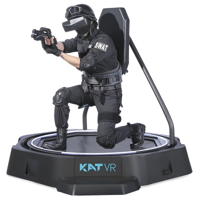

In the last half a year I have been working quite a lot with the meta quest headsets. Through my work I have been able to test their functionality and develop applications for them. I can safely say they are really cool! However, in many games walking around is quite a poor experience - mainly done with the joystick. In this post I'd like to present some movement ideas that we as developrs could consider as we develop games for these glasses.

The image below is not the kind of natural walking we are talking about today. Instead the idea is that the user has a (rectangular) room area in real life where they are able to walk around, and we as game designers are trying to make the most out of that room. So the question comes down to this: How can we fit as much in-game space into a fixed about of physical space?

### Using non-eucledian space with portals

Portals allow you to create space where there are none, so they are an effective solution. They are also a really unique solution, as portals are something that don't exists in our universe. They break a bit of emersion, but are really cool. They could work well in a sci-fi escape room for example.

Not surprisingly I'm not the first to think of this concept. If you are interested in this concept, there is a fantastic paper by a couple researches from the University of Cape Town. The paper is called [VR Natural Walking in Impossible Spaces](https://people.cs.uct.ac.za/~jgain/wp-content/papercite-data/pdf/lochner2021.pdf) and it has explored this concept a lot. The general idea is that if your game or application is indoors, you can fuse many rooms on top of each other. As you go through the house you discover new rooms even though you are only doing circles in real life. In the game this seems like non-euclidean space, but any sane developer will implement this using portals. You can put the portals seemlessly in corridoors and alike to hide the transition to different rooms. The video below shows the experience quite well.

<iframe width="560" height="315" src="https://www.youtube.com/embed/WErjyjvM0JY" title="YouTube video player" frameborder="0" allow="accelerometer; autoplay; clipboard-write; encrypted-media; gyroscope; picture-in-picture" allowfullscreen></iframe>

### Exploiting verticality

- Elevators
- Stairs

### Conclusion
- Need a room to walk around
- better for certain types of games
- any more ideas? Let me know